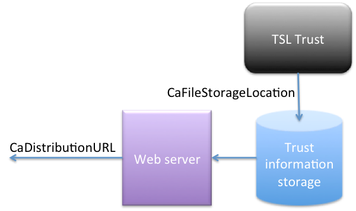

</img>

# Deployment Guide - TSL Trust

### Version 1.3 - 2017-03-28

---

## Table of Contents

1. [**Overview**](#overview)

    1.1. [Server components](#server-components)

    1.2. [Server separation and clustering](#server-separation-and-clustering)

2. [**Installation and deployment**](#installation-and-deployment)

    2.1. [Generic](#generic)

    2.1.1. [Tomcat server configuration](#tomcat-server-configuration)

    2.1.1.1. [Increasing the heap memory](#increasing-the-heap-memory)

    2.1.1.2 [Perm Gen memory](#perm-gen-memory)

    2.1.1.3 [Adding class path to the external libraries:](#adding-class-path-to-the-external-libraries:)

    2.2. [TSL Trust administration service](#tsl-trust-administration-service)

    2.2.1. [Tomcat server configuration for Shibboleth authentication (optional)](#tomcat-server-configuration-for-shibboleth-authentication-(optional))

    2.2.2. [Discovery feed (optional)](#discovery-feed-(optional))

    2.2.2.1 [Installing the maintenance application](#installing-the-maintenance-application)

    2.2.3. [Database configuration](#database-configuration)

    2.2.3.1. [MySQL](#mysql)

    2.2.3.2. [Oracle](#oracle)

    2.2.4. [User authentication and login pages](#user-authentication-and-login-pages)

    2.2.5. [Configuration of trust information publication](#configuration-of-trust-information-publication)

    2.3. [TSL Trust - Signature validation service](#tsl-trust---signature-validation-service)

    2.3.1 [Tomcat server configuration](#tomcat-server-configuration)

    2.3.2 [web.xml deployment descriptor configuration](#web.xml-deployment-descriptor-configuration)

3. [**Service configuration and running services**](#service-configuration-and-running-services)

    3.1 [TSL Trust -Administration Service](#tsl-trust--administration-service)

    3.2. [Configuration of LotL signature certificates](#configuration-of-lotl-signature-certificates)

    3.3. [TSL Trust signature validation service](#tsl-trust-signature-validation-service)

<a name="overview"></a>
## 1. Overview

The TSL Trust application package consists of two separate web
applications that can be run and maintained separately on separate
servers and locations.

1.  The core TSL Trust policy administration and certification service
    (TTAdminService.war), and;

2.  The sample TSL Trust signature validation service
    (TTSigvalService.war).

The signature validation service is deployed and run as a single .war
that can run in a standard servlet container such as Apache Tomcat.

The TSL Trust policy administration service provides a main
administrator interface accessible through a web browser interface.

<a name="server-components"></a>
### 1.1. Server components

Service|WAR|Description
---|---|---
Signature validation service|TTSigvalService.war|Signature validation web service
TSL Trust asministration service|TTAdminService.war|Admministration web service for creating signature validation policies

<a name="server-separation-and-clustering"></a>
### 1.2. Server separation and clustering

It is recommended to run the two services on different web servers in
production due to different workload and the security requirements.

The signature validation web service is self-contained (caches and
maintains it’s own trust information) and is stateless (does not run in
any session context) and runs therefore well as a clustered service
through any number of individually deployed instances.

A single policy administration service generates trust information for
any number of signature validation services. The policy administration
service runs in a session context based on session cookies and must run
on a single server and should be exposed on the Internet through a web
server to allow signature validation services to download trust
information through an SSL /TSL channel.

The workload on the administration service is normally very low since
policy changes normally are rather rare, while the workload on signature
validation services may be very high.

<a name="installation-and-deployment"></a>
## 2. Installation and deployment

<a name="generic"></a>
### 2.1. Generic

Deployment and configuration of the policy administration service and
the signature validation service should in principle follow the
following logical order:

1.  Configure web servers used to expose deployed services. This
    includes in particular SSL configurations, user authentication for
    authenticating administrators and defining URLs used to expose
    services.

2.  Configure application servers (Provided examples describes
    procedures for setting up a Tomcat server)

3.  Create and configure any external databases that are used by the
    policy administration service for storing policies and logs.

4.  Make sure that the web.xml file data folder location is pointing to an appropriate location. Then deploy and start the policy administration web application. **Note:** Default files will be generated at the specified location. Once this is done, stop the application and edit configuration files before starting the application again.

5.  Start the policy administration web application with correct configuration parameter values.

6.  Log on to the administration service using the super user account
    settings configured in step 4. Steps 7- 9 below are optional.

7.  Obtain an administration privileges request password in the
    authorization menu and send it to administrators that needs access
    (if applicable)

8. Allow administrators to log in to the service and apply for
    administration rights.

9. As super administrator, grant administrators necessary rights to
    administrate policies.

10. Allow a policy administrator to define at least one signature
    validation policy.

11. Restart the policy administration service (or wait for the
    next server update) to generate and publish trust information.

12. Configure and deploy any number of publically facing signature
    validation services, using the deployed administration service as
    the source of trust information.

More elaborate details are provided in the following subsections.

<a name="tomcat-server-configuration"></a>
#### 2.1.1. Tomcat server configuration

The following configurations should be done to the application server
(servlet containers) where a signature validation service and policy
administration service are deployed.

The configuration steps are described for deployment on an Apache Tomcat
server.

<a name="increasing-the-heap-memory"></a>
##### 2.1.1.1. Increasing the heap memory

Heap memory need to be set to suitable size that allows normal
operations. The required amount of heap memory may vary according to the
workload of the server, in particular for the signature validation
service. It is advisable to assign as much heap memory as possible
without interfering with other applications hosted on the server. The
following settings should however be adequate for normal operations of
both services.

> Create new file: /%CATALINA\_HOME%/bin/setenv.sh (Unix) or setenv.bat
> (windows) or amend any existing version of this file with the
> following statement:
>
> **CATALINA\_OPTS="-Xms512m –Xmx2048m"**
>
> (512mb committed memory and 2048mb max heap memory)

<a name="perm-gen-memory"></a>
##### 2.1.1.2 Perm Gen memory

The Permanent Generation memory (PermGen) holds metadata about all java
classes. It is normally not problem to run the TSL Trust services in
Tomcat using standard PermGen memory settings. However, if have other
applications running on the same server, then adding TSL Trust may cause
you to run out of PermGen memory. In such case, the PermGen memory space
needs to be increased. This is done by adding the following option to
CATALINA\_OPTS in the setenv.sh file described in the previous section:

> -XX:MaxPermSize=256m

The whole setting could look like:

> CATALINA\_OPTS="-Xms512m –Xmx2048m" -XX:MaxPermSize=256m

Note: the values above are only examples. You need to determine what
memory size that is appropriate for your environment.

<a name="adding-class-path-to-the-external-libraries:"></a>
##### 2.1.1.3 Adding class path to the external libraries:

Both services make use of libraries that may not not packaged with the
.war deployment builds as doing so may causes problems with Tomcat class
loading.

Libraries that may have to be provided outside of the .war are:

-   The IAIK Crypto Library (**iaik-jce-full-4.0.jar)**

-   The SQLite JDBC driver library (**sqlite-jdbc-3.7.2.jar**)

The IAIK Library must be provided separately and the SQLite JDBC Driver
may in some in some environments need to be provided separately.

> **NOTE: It has been a plan for considerable time to remove dependency on the IAIK crypto library. It is not used > for anything that could not be handled by Bouncycastle. TSL Trust has been tested and built with version 4.0 of > the IAIK library only. It may work also with newer versions of the library.**

Such libraries need to be added to the Tomcat class loader separately,
which may be accomplished through the following steps:

1\) Edit the file: /%CATALINA\_HOME%/conf/catalina.properties

> Add the following information to the “common loader” settings:
>
> **%LOCATION\_OF\_LIBS%/\*.jar**
>
> where %LOCATION\_OF\_LIBS% is the location of added external library
> .jar files (e.g. “/Library/TomcatLibs”).
>
> Example:
>
> common.loader=\${catalina.base}/lib,\${catalina.base}/lib/\*.jar,\${catalina.home}/lib,\${catalina.home}/lib/\*.jar**,/Library/TomcatLibs/\*.jar**

2\) Place the referenced jar files in the specified location (e.g. in
“/Library/TomcatLibs/” following the example above).

The IAIK library can be obtained from:

> <http://jce.iaik.tugraz.at/sic/Products/Core-Crypto-Toolkits/JCA-JCE>

The SQLite JDBC driver library can be obtained from:

> https://mvnrepository.com/artifact/org.xerial/sqlite-jdbc

Libraries that are loaded by Tomcat separately must be excluded from the
POM of the TT Common project, but must be present in the POM of the TT
Maintenance project (as it is run as a swing application and dot
deployed in Tomcat).

This is the default POM configuration for both projects.

To exclude the library from the build, add the scope “provided” to the
dependency in the TT Common POM. Eg in the POM of TT Common:

    <dependency>
        <groupId>org.xerial</groupId>
        <artifactId>sqlite-jdbc</artifactId>
        <scope>provided</scope>
    </dependency>

Note that the version element is provided in the main project POM
(dependency management settings) and therefore not provided here.

The corresponding dependency for the TT Maintenance project (where the
library .jar must be included) is the same as above but excluding the
scope element, that is:

    <dependency>
        <groupId>org.xerial</groupId>
        <artifactId>sqlite-jdbc</artifactId>
    </dependency>

<a name="tsl-trust-administration-service"></a>
### 2.2. TSL Trust administration service

<a name="tomcat-server-configuration-for-shibboleth-authentication-(optional)"></a>
#### 2.2.1. Tomcat server configuration for Shibboleth authentication (optional)

The administration service is designed to support user authentication
data obtained from SAML based authentication. Current implementation is
tested together with the Shibboleth Service Provider module with Apache
web server to support SAML authentication.

If SAML authentication using Shibboleth is used for administrator
authentication, the Tomcat server needs to be configured to receive SAML
authentication data using the AJP connector by editing the Tomcat
Server.xml file as follows:

> Edit the connector port 8009 in /%CATALINA\_HOME%/conf/Server.xml

    <Connector port="8009"
    	     enableLookups="false" redirectPort="8443" protocol="AJP/1.3"
             URIEncoding="UTF-8"   tomcatAuthentication="false" />

<a name="discovery-feed-(optional)"></a>
#### 2.2.2. Discovery feed (optional)

The policy administration service may be combined with a discovery feed
service that provides JSONP formatted information about SAML based
identity providers. This discovery feed provides information about
available identity providers if the optional login page for SAML based
user login is used.

Such discovery feed service is not provided as part of this open source
publication but such service can be provided by a separate .war that is
available for download.

This feed service serves no purpose if user authentication is provided
by other means than through SAML based authentication.

The discovery feed service also serves the policy administration web
application by providing user-friendly display names of identity
providers in the user administration menus. In this context the
discovery feed service is totally optional. Absent the discovery feed
service, the entityID of each identity provider will be displayed as the
friendly name.

Following deployment of the downloadable discovery feed .war
(JsonpDiscoFeed.war), the service needs configuration by editing the
web.xml file of the service

**Note:** Consult your Tomcat documentation for the location of web.xml
files of deployed services. By default the web.xml files are located at
/%CATALINA\_HOME%/webbapps/JsonpDiscoFeed /WEB-INF/web.xml.

Set the values of the MetaDataCache init-parm value:

    <init-param>
      <param-name>MetaDataCache</param-name>
      <param-value>/opt/local/var/run/shibboleth/eid2-test-1.0.xml</param-value>
    </init-param>

Set the MetaDataCache param-value to the location of the SAML metadata
cache file of your SAML Service Provider installation (e.g. Shibboleth
SP).

<a name="installing-the-maintenance-application"></a>
##### 2.2.2.1 Installing the maintenance application

The admin-maintenance-1.0-jar-with-dependencies.jar application provides
functions for configuration and test.

This .jar should be stored in a suitable location on the hard drive of
the server hosting the policy administration web service. The
application should be placed in a dedicated folder, as it will place
generated configuration files as well as backup data in two folders
placed in it’s home directory.

The maintenance application can be started as a normal java application
(normally by double clicking on the application in a file explorer, or
by starting it from the command line using the “java -jar
admin-maintenance-1.0-jar-with-dependencies.jar “ command. This .jar
file may be renamed to any preferred name.

<a name="database-configuration"></a>
#### 2.2.3. Database configuration

The policy administration service creates and maintains a number of
internal database files using SQLite. These databases are automatically
created and maintained without any need of external configuration. These
databases do not require any backup as all data kept in these databases
are rebuilt automatically in case the database files are lost or erased.

In addition to these internal databases, the policy administration
service connects to two databases using the hibernate framework:

-   The policy database, storing all data related to configured
    signature validation policies.

-   The log database.

TSL Trust supports simplified configuration of database connections
through parameter settings in the web.xml deployment descriptor of the
policy administration service. This allows database configuration
through three simple parameters (connection URL, user name and
password). This simplified configuration is supported for MySQL, and
SQLite databases. It is also supported for Oracle databases if
appropriate Oracle dependencies (Maven dependencies) are added to the
project and the project is rebuilt.

For other databases, or for more advanced configuration options,
external hibernate.cfg.xml files can be created and assigned as
configuration source through settings in the web.xml deployment
descriptor. See section 3.1.2 for further details.

The policy and log database consists of three database tables each that
can be created using SQL script in the following sections.

<a name="mysql"></a>
##### 2.2.3.1. MySQL
**Policy Database:**

```
SET @OLD_UNIQUE_CHECKS=@@UNIQUE_CHECKS, UNIQUE_CHECKS=0;
SET @OLD_FOREIGN_KEY_CHECKS=@@FOREIGN_KEY_CHECKS, FOREIGN_KEY_CHECKS=0;
SET @OLD_SQL_MODE=@@SQL_MODE, SQL_MODE='TRADITIONAL';

CREATE SCHEMA IF NOT EXISTS `tsltrust_policy` DEFAULT CHARACTER SET utf8 ;
USE `tsltrust_policy` ;

-- -----------------------------------------------------
-- Table `tsltrust_policy`.`ExternalCert`
-- -----------------------------------------------------
CREATE  TABLE IF NOT EXISTS `tsltrust_policy`.`ExternalCert` (
  `certId` VARCHAR(255) NOT NULL ,
  `cert` TEXT NULL DEFAULT NULL ,
  PRIMARY KEY (`certId`) )
ENGINE = InnoDB
DEFAULT CHARACTER SET = utf8;


-- -----------------------------------------------------
-- Table `tsltrust_policy`.`TslPolicy`
-- -----------------------------------------------------
CREATE  TABLE IF NOT EXISTS `tsltrust_policy`.`TslPolicy` (
  `name` VARCHAR(255) NOT NULL ,
  `states` TEXT NULL DEFAULT NULL ,
  `serviceTypes` TEXT NULL DEFAULT NULL ,
  `statusTypes` TEXT NULL DEFAULT NULL ,
  `signStatus` TEXT NULL DEFAULT NULL ,
  `expiredTsl` INT(11) NULL DEFAULT NULL ,
  PRIMARY KEY (`name`) )
ENGINE = InnoDB
DEFAULT CHARACTER SET = utf8;


-- -----------------------------------------------------
-- Table `tsltrust_policy`.`validationpolicy`
-- -----------------------------------------------------
CREATE  TABLE IF NOT EXISTS `tsltrust_policy`.`validationpolicy` (
  `name` VARCHAR(255) NOT NULL ,
  `description` TEXT NULL DEFAULT NULL ,
  `status` VARCHAR(255) NULL DEFAULT NULL ,
  `tslPolicies` TEXT NULL DEFAULT NULL ,
  `addCertIds` TEXT NULL DEFAULT NULL ,
  `blockCertIds` TEXT NULL DEFAULT NULL ,
  PRIMARY KEY (`name`) )
ENGINE = InnoDB
DEFAULT CHARACTER SET = utf8;


SET SQL_MODE=@OLD_SQL_MODE;
SET FOREIGN_KEY_CHECKS=@OLD_FOREIGN_KEY_CHECKS;
SET UNIQUE_CHECKS=@OLD_UNIQUE_CHECKS;
```

**Log database:**

```
SET @OLD_UNIQUE_CHECKS=@@UNIQUE_CHECKS, UNIQUE_CHECKS=0;
SET @OLD_FOREIGN_KEY_CHECKS=@@FOREIGN_KEY_CHECKS, FOREIGN_KEY_CHECKS=0;
SET @OLD_SQL_MODE=@@SQL_MODE, SQL_MODE='TRADITIONAL';

CREATE SCHEMA IF NOT EXISTS `tsltrust_log` DEFAULT CHARACTER SET utf8 ;
USE `tsltrust_log` ;

-- -----------------------------------------------------
-- Table `tsltrust_log`.`Admin`
-- -----------------------------------------------------
CREATE  TABLE IF NOT EXISTS `tsltrust_log`.`Admin` (
  `logtime` VARCHAR(50) NOT NULL ,
  `logevent` VARCHAR(255) NULL DEFAULT NULL ,
  `logdesc` VARCHAR(500) NULL DEFAULT NULL ,
  `logorigin` VARCHAR(255) NULL DEFAULT NULL ,
  PRIMARY KEY (`logtime`) )
ENGINE = MyISAM
DEFAULT CHARACTER SET = utf8;


-- -----------------------------------------------------
-- Table `tsltrust_log`.`Console`
-- -----------------------------------------------------
CREATE  TABLE IF NOT EXISTS `tsltrust_log`.`Console` (
  `logtime` VARCHAR(50) NOT NULL ,
  `logevent` VARCHAR(255) NULL DEFAULT NULL ,
  `logdesc` VARCHAR(500) NULL DEFAULT NULL ,
  `logorigin` VARCHAR(255) NULL DEFAULT NULL ,
  PRIMARY KEY (`logtime`) )
ENGINE = MyISAM
DEFAULT CHARACTER SET = utf8;


-- -----------------------------------------------------
-- Table `tsltrust_log`.`Major`
-- -----------------------------------------------------
CREATE  TABLE IF NOT EXISTS `tsltrust_log`.`Major` (
  `logtime` VARCHAR(50) NOT NULL ,
  `logevent` VARCHAR(255) NULL DEFAULT NULL ,
  `logdesc` VARCHAR(500) NULL DEFAULT NULL ,
  `logorigin` VARCHAR(255) NULL DEFAULT NULL ,
  PRIMARY KEY (`logtime`) )
ENGINE = MyISAM
DEFAULT CHARACTER SET = utf8;


SET SQL_MODE=@OLD_SQL_MODE;
SET FOREIGN_KEY_CHECKS=@OLD_FOREIGN_KEY_CHECKS;
SET UNIQUE_CHECKS=@OLD_UNIQUE_CHECKS;
```

<a name="oracle"></a>
##### 2.2.3.2. Oracle

**Policy database:**

```
CREATE TABLE ExternalCert (
  "certId" VARCHAR(255) NOT NULL,
"cert" VARCHAR(4000),
CONSTRAINT "CERT_ID_PK" PRIMARY KEY ("certId"));

-- -----------------------------------------------------
-- Table "tsltrust_policy"."TslPolicy"
-- -----------------------------------------------------
CREATE  TABLE TslPolicy (
  "name" VARCHAR(255) NOT NULL,
"states" VARCHAR(4000),
"serviceTypes" VARCHAR(4000),
"statusTypes" VARCHAR(4000),
"signStatus" VARCHAR(4000),
  "expiredTsl" INT,
CONSTRAINT "NAME_PK" PRIMARY KEY ("name"));

-- -----------------------------------------------------
-- Table "tsltrust_policy"."validationpolicy"
-- -----------------------------------------------------
CREATE TABLE validationpolicy (
  "name" VARCHAR(255) NOT NULL ,
"description" VARCHAR(4000),
"status" VARCHAR(255),
"tslPolicies" VARCHAR(4000),
"addCertIds" VARCHAR(4000),
"blockCertIds" VARCHAR(4000),
CONSTRAINT "NAME_PK1" PRIMARY KEY ("name"));
```

**Log database:**

```
CREATE TABLE "Admin" (
  "logtime" VARCHAR(50) NOT NULL ,
"logevent" VARCHAR(255) ,
"logdesc" VARCHAR(500) ,
"logorigin" VARCHAR(255) ,
CONSTRAINT "LOGTIME_PK" PRIMARY KEY ("logtime") );

-- -----------------------------------------------------
-- Table "tsltrust_log"."Console"
-- -----------------------------------------------------
CREATE  TABLE Console (
  "logtime" VARCHAR(50) NOT NULL ,
"logevent" VARCHAR(255) ,
"logdesc" VARCHAR(500) ,
"logorigin" VARCHAR(255) ,
CONSTRAINT "LOGTIME_PK2" PRIMARY KEY ("logtime") );

-- -----------------------------------------------------
-- Table "tsltrust_log"."Major"
-- -----------------------------------------------------
CREATE  TABLE Major (
  "logtime" VARCHAR(50) NOT NULL ,
"logevent" VARCHAR(255) ,
"logdesc" VARCHAR(500) ,
"logorigin" VARCHAR(255) ,
CONSTRAINT "LOGTIME_PK3" PRIMARY KEY ("logtime") );
```


<a name="user-authentication-and-login-pages"></a>
#### 2.2.4. User authentication and login pages

Administrators must be authenticated in order to request and obtain
administration privileges.

By default, the TSL Trust policy administration service supports the
following authentication methods:

-   Basic authentication

-   Digest authentication

-   SAML authentication (supported by a Shibboleth SP module in an
    Apache web server).

The policy administration module provides allows easy addition of custom
user authentication methods by adding simple authentication handler
classes to the administration servlet module.

New authentication handlers are added by extending the
AuthenticationHandler abstract class, and by extending the
authentication handler selection logic in the
AuthenticationHandlerFactory class.

The following AuthenticationHandler classes are provided by default:

Class | Implemented authentication method
---|---
ShibAuthenticationHandler.java | Handles SAML based authentication provided by a Shibboleth module in the web server
BasicAuthenticationHandler.java | Handles basic authentication, digest authentication and client certificate authentication.
DevAuthenticationHandler.java | This handler allows users to login using web cookies only when the application is run in devmode (By setting the mode parameter in the web.xml deployment descriptor to “devmode”). An authentication cookie holding a test identity can be set by accessing the user.jsp web page. This authentication handler is disabled when the administration service is run in production mode.


When basic authentication handler is set the parameters supplied to the application for attribute type is fixed to “**User ID**” and identity source is set to "**Basic Authentication**" for basic authentication, "**Digest Authentication**" for digest authentication and "**Client Cert Authentication**" for client certificate authentication.

Respectively, when this authentication handler is used, the SuperAdminAttribute and SuperAdminIdP parameters described in 3.1.2 need to be set to the corresponding values to match the identity parameters of the super admin user. That is, setting the SuperAdminAttribute prameter to “User ID” and the SuperAdminIdP parameter to the appropriate choice of {"Basic Authentication", "Digest Authentication" or "Client Cert Authentication"}

The DevAuthenticationHandler.java allows users to login using web cookies only when the application is run in devmode (By setting the mode parameter in the web.xml deployment descriptor to “devmode”). An authentication cookie holding a test identity can be set by accessing the user.jsp web page. This authentication handler is disabled when the administration service is run in production mode.

Access builtin dev authentication by targeting the user.jsp file such as for local deployment:
> http://localhost:8080/TTAdminService/user.jsp


<a name="configuration-of-trust-information-publication"></a>
#### 2.2.5. Configuration of trust information publication

The TSL Trust administration service will publish trust information in
the form of root certificates, CA certificates and revocation
information at a location specified in the configuration of the service.
This data need to be published and made publicly available using https
access (to protect integrity of root certificates).

</img>

This can be accomplished e.g. by creating a virtual host in the same
Apache web server that is used to publish the web service.

The trust information may be exported and published on a separate
server. The means of doing to is outside the scope of the provided
service.

However, there are many good reasons to publish this data directly from
the location where TSL Trust stores it. This server is already a public
facing server since it hosts at least one web service and to not
transfer this data to another server reduces the attack surface for
altering this information.

<a name="tsl-trust---signature-validation-service"></a>
### 2.3. TSL Trust - Signature validation service

<a name="tomcat-server-configuration"></a>
#### 2.3.1 Tomcat server configuration

No specific configurations in addition to the generic configuration
steps.

<a name="web.xml-deployment-descriptor-configuration"></a>
#### 2.3.2 web.xml deployment descriptor configuration

The signature validation service must be configured by parameter
settings in the web.xml deployment descriptor. Configuration parameters
are described in section 3.2.

<a name="service-configuration-and-running-services"></a>
## 3. Service configuration and running services

<a name="tsl-trust--administration-service"></a>
### 3.1 TSL Trust -Administration Service
The web.xml deployment descriptor specifies the generic context parameter **DataLocation**
This parameter decides where TSL Trust store files and configuration data.
Configuration parameters will be stored in a folder named **cfg**. The most important files are:

File|Description
---|---
tslTrustConfig.json|Json file holding configuration parameters
lotlSigCert.pem|A line separated list of PEM certificates that are valid for validating the signature on the top TSL (The LotL issued by the EU Commission).

The **tslTrustConfig.json** file specifies the following parameters:

Parameter|Value
---|---
Mode | This parameter must be set to “production” for proper operation of the service. All other values are reserved for test purposes
LotlURL | The URL location of the EU root TSL (Trust Service status List), also known as the LotL (List of the Lists). This is the root source of all TSL information that is imported into TSL Trust. Other national TSLs that are imported are located using references found in the LotL.
SuperAdminID | The value of the identifying attribute of the super administrator user.
SuperAdminAttribute | The attribute type of the identifying attribute value of the super administrator. If authentication method is Shibboleth SAML, then this refers to the mapped name of the attribute in the SAML implementation that provides identity information to TSL Trust using an AJP connector (i.e. the name of the attribute given to the TSL Trust administration service). If authentication method is one of Basic, Digest or Client Cert authentication set below, then this parameter should be set to the value "**User ID**".
SuperAdminIdP | This parameter decides the identity source required for authenticating the preconfigured super admin. If Authentication mode is using Shibboleth SAML, then this parameter holds the entityId of the Identity Provider (IdP) that is trusted to identify the super administrator user. Otherwise, this parameter holds the identifier for the selected authentication method with one of the following values <br><br>**Basic Authentication** - For basic HTTP auth<br>**Client Cert Authentication** - For client certificate auth<br>**Digest Authentication** - For HTTP digest auth
DiscoFeedUrl | The URL (including any necessary query string) for obtaining JSON/JSONP discovery data for the SAML federation within which this service acts as a Service Provider (SP). This parameter is optional. The identified source must provide JSON according to a proprietary format used in the Swedish eID framework. (See https://eid.svelegtest.se/disco/json?action=idplist for a sample JSON feed according to the expected format).
MaxConsoleLogSize | The maximum number of records that are kept in the console log. Records in excess of this size limit are automatically deleted from the log. Increasing this size limit provides longer page reload times in the log view of the administration service.
MaxMajorLogAge | Number of days that records are kept in the major event log.
TSLrecacheTime | Number of hours between TSL reaches, certificate revocation and issuance of certificates for new compliant services. Times less than one hour can be specified
CaCaountry | The country name attribute value used to construct a DN for TSL Trust policy CAs
CaOrganizationName | The organization name attribute value used to construct a DN for TSL Trust policy CAs
CaOrgUnitName | The organization unit name attribute value used to construct a DN for TSL Trust policy CAs
CaSerialNumber | The serial number attribute value used to construct a DN for TSL Trust policy CAs
CaCommonName | The common name attribute value used to construct a DN for TSL Trust policy CAs. This parameter uses the string “\#\#\#\#” as a placeholder for the name of the policy that is implemented by the policy CA, providing uniqueness for CA names. If no “\#\#\#\#” string is present, the policy name will precede the specified common name value in this parameter.
CaFileStorageLocation | The path to the directory where all trust data (root certificates, CA certificates and revocation data) generated by TSL Trust is stored. This parameter must end with a “/” character to signal that it specifies a directory and not a file.
CaDistributionURL | The URL for accessing information stored at the CaFileStorageLocation. Information stored at this location must be published under the URL specified by this parameter. This parameter must end with a “/” character. TSL Trust will append this URL string to construct CRL distribution point URL reference for revocation information related to each policy CA.
LogDbConnectionUrl | This parameter holds either a database connection URL to the Log Database, or alternatively a file path to an external hibernate.cfg.xml file (including the file name) for the log database. If a connection URL is specified, it must start with either “jdbc:sqlite”, “jdbc:mysql”, or “jdbc:oracle” for connection to SQLite, MySQL, and Oracle databases using programmatically generated configurations. If a database connection URL is specified, hibernate configuration is generated using the associated parameters below below. If an external hibernate.cfg.xml file path is specified, then the configuration parameters below are ignored.
LogDbUserName | User name for accessing the log database
LogDbPassword | Password for accessing the log database
PolicyDbConnectionUrl | Database connection URL, or alternatively, a file path to an external hibernate.cfg.xml file (including the file name) for the Policy Database.
PolicyDbUserName | User name for accessing the policy database
PolicyDbPassword | Password for accessing the policy database
DbAutoCreateTables | Activating this function includes the hibernate.hbm2ddl.auto property. Default false (causing this property to be omitted). Setting this parameter to "update" creates non-existing databases, and to "create" recreates new database tables.<br><br> **Important note:** While it may be useful to activate this feature during installation in order to have database tables auto generated, it is NOT recommended to having this feature turned on in production. Once the tables are created using this feature (or using the provided scripts), this feature should be turned off.<br><br> **Note** also that hibernate.hbm2ddl.auto will not work with all databases. It works quite well however to generate SQLite database tables.
DbVerboseLogging | A value set to true generates verbose logging of database events

**Example config file:**

    {
      "Mode": "devmode",
      "LotlURL": "https://ec.europa.eu/information_society/policy/esignature/trusted-list/tl-mp.xml",
      "MaxConsoleLogSize": "1000",
      "MaxMajorLogAge": "90",
      "TSLrecacheTime": "1",
      "CaCountry": "SE",
      "CaOrganizationName": "Swedish E-Identification Board Test",
      "CaOrgUnitName": "Signature validation",
      "CaSerialNumber": "SE555555-5555",
      "CaCommonName": "Swedish E-Identification Board - Test validation service",
      "CaFileStorageLocation": "/opt/webapp/tsltrust-eln/admin/publish",
      "CaDistributionURL": "https://ttadmin.example.com/trustinfo",
      "LogDbConnectionUrl": "jdbc:mysql://localhost:3306/tsltrust_log",
      "LogDbUserName": "tsltrust",
      "LogDbPassword": "tsltrustPw",
      "PolicyDbConnectionUrl": "jdbc:mysql://localhost:3306/tsltrust_policy",
      "PolicyDbUserName": "tsltrust",
      "PolicyDbPassword": "tsltrustPw",
      "DbAutoCreateTables": "true",
      "DbVerboseLogging": "false",
      "SuperAdminID": "1234567890",
      "SuperAdminAttribute": "User ID",
      "SuperAdminIdP": "Digest Authentication",
      "DiscoFeedUrl": ""
    }


<a name="configuration-of-lotl-signature-certificates"></a>
### 3.2. Configuration of LotL signature certificates

The EU root Trust Service status List (TSL), also known as the LotL, is
the root of trust for all TSL supported EU services. Signature
certificates for national TSLs are obtained from the LotL, but the
certificates needed to verify the LotL must be configured manually.

The TSL Trust policy administration service ships with preloaded
signature certificates for LotL verification. This means that the
signature on current (at time of code release) LotL can be verified
without configuration of LotL signing certificates.

However, for the event that the signature certificate of the EU LotL
would change after the release of this code, the new signature
certificate need to be added to the policy administration service to
support continuous verification of the signature on the LotL.

The preloaded LotL signature certificates are stored in the “cfg” folder
in the location specified by the “DataLocation” parameter in web.xml, in
a file named lotlSigCert .pem

The the current working set of certificates that should be included in the lotlSigCert.pem file are the following set:

    -----BEGIN CERTIFICATE-----
    MIIGgDCCBGigAwIBAgIUWH+El24rfQt9YeTtrAZC9UzssuQwDQYJKoZIhvcNAQEFBQAwgZIxCzAJ
    BgNVBAYTAk5MMSAwHgYDVQQKExdRdW9WYWRpcyBUcnVzdGxpbmsgQi5WLjEoMCYGA1UECxMfSXNz
    dWluZyBDZXJ0aWZpY2F0aW9uIEF1dGhvcml0eTE3MDUGA1UEAxMuUXVvVmFkaXMgRVUgSXNzdWlu
    ZyBDZXJ0aWZpY2F0aW9uIEF1dGhvcml0eSBHMjAeFw0xNTEyMDQxMjA5MzVaFw0xODEyMDQxMjA5
    MjRaMHkxCzAJBgNVBAYTAkJFMRAwDgYDVQQIEwdCcnVzc2VsMRIwEAYDVQQHEwlFdHRlcmJlZWsx
    HDAaBgNVBAoTE0V1cm9wZWFuIENvbW1pc3Npb24xEzARBgNVBAsTCkRHIENPTk5FQ1QxETAPBgNV
    BAMMCEVDX0NORUNUMIIBIjANBgkqhkiG9w0BAQEFAAOCAQ8AMIIBCgKCAQEAtXQoPmP4DPSZDKuH
    cecqX6durKKczAuiEimbZAuuOgMQ9P7g2EIWrACuwNLXKxFXikxOSJWg+nYytJ/ty+1njYa8Nmhp
    4MYc4UoF3WzQCiz63atK9AuNOMrODBaAGrQNYqXyuEet+i5NaibRYPEtptXzoY0Pif6Zv3qauBlC
    Jnf7kbGkHq9sh8sEXnMaWGjm0EHna8NTh1LjnzCb6N2capQDt+RRrUiBee3YMST3Fo3kKQTKaBvv
    cYAJ4Mgs/9+Dvwm52dIaMc1vaP1MN2dUW45EWDKtaRfV9flkAy0iT8P8qvUkyGn1XBXnM/gyohOq
    9cSaP09vPMX6ArmFPlQSiwIDAQABo4IB5DCCAeAwWAYDVR0gBFEwTzAIBgYEAIswAQIwQwYKKwYB
    BAG+WAGDEDA1MDMGCCsGAQUFBwIBFidodHRwOi8vd3d3LnF1b3ZhZGlzZ2xvYmFsLm5sL2RvY3Vt
    ZW50ZW4wJAYIKwYBBQUHAQMEGDAWMAoGCCsGAQUFBwsCMAgGBgQAjkYBATB0BggrBgEFBQcBAQRo
    MGYwKgYIKwYBBQUHMAGGHmh0dHA6Ly9vY3NwLnF1b3ZhZGlzZ2xvYmFsLmNvbTA4BggrBgEFBQcw
    AoYsaHR0cDovL3RydXN0LnF1b3ZhZGlzZ2xvYmFsLmNvbS9xdmV1Y2FnMi5jcnQwRgYKKoZIhvcv
    AQEJAQQ4MDYCAQGGMWh0dHA6Ly90c2EwMS5xdW92YWRpc2dsb2JhbC5jb20vVFNTL0h0dHBUc3BT
    ZXJ2ZXIwEwYKKoZIhvcvAQEJAgQFMAMCAQEwDgYDVR0PAQH/BAQDAgZAMB8GA1UdIwQYMBaAFOD4
    DvnUtfJ/SSO2w3nHozUfhnqIMDsGA1UdHwQ0MDIwMKAuoCyGKmh0dHA6Ly9jcmwucXVvdmFkaXNn
    bG9iYWwuY29tL3F2ZXVjYWcyLmNybDAdBgNVHQ4EFgQUQX94XsDFzQFNiSGpboQqB53MiyAwDQYJ
    KoZIhvcNAQEFBQADggIBAJfRbSpp2RTfVtyu4G1TDVXE6RgoIQ5XrUASAmhDWktT5PJReSg5INMF
    xi3jSPAO7p29bEU32wllZGPVN+A9b2SZmhHyYx9ZoBTMekKlx0qHkU4FfcicIznXo9EVplMtgjpl
    qRltiLqxwXU5uIxKJ2R6BJwjokUWcpei1ifs14SgAve8firXwiG1kFcoClfLjyj4SuDFxT+0e/dh
    fGfQMfvVBp4xa5tOGYDS7kzf7xvftYlPHW1AbEzjuPmViGgen8ZD/WkuqzdygizOocFQNshGH/mF
    nQxT4ILAubWJX5gcvmjaZ9N/Lxh041Ra2s8YK5l1DHBcZzz6y2j9OhxPgCvzz3/71DsiGVaK/TO5
    HxJNcjKlkBblXE4dgy3wqjpUzqkVltC+Xli23Ljny4tenz0QNOx3SQBA1R/hZE5QKD0L0wOc4Np1
    VxGZbCWGFqta8KKhEA19KlW03Yix9aqe86iNKoJm3n/4BBgdYGu5c+DnqKWj3D7NnxCVZwuLOKzW
    SCEisl2kHdgnZ3Qix5Vc5QYWexSHeQfCuJAARCDvhdnOidUyiZRnQ6R4VHt0GgNQcYKrmz+UdEro
    SeQCuSvXIh+LIEJpayWSo9vxi3OgO2IRSi+7Kh5h7LAfWcIwpVY8u0BpRoNJg5xMjvF49GDJc1Qe
    KdlqCBm05N4c2d5t5/aa
    -----END CERTIFICATE-----
    -----BEGIN CERTIFICATE-----
    MIIGgTCCBGmgAwIBAgIUeaHFHm5f58zYv20JfspVJ3hossYwDQYJKoZIhvcNAQEFBQAwgZIxCzAJ
    BgNVBAYTAk5MMSAwHgYDVQQKExdRdW9WYWRpcyBUcnVzdGxpbmsgQi5WLjEoMCYGA1UECxMfSXNz
    dWluZyBDZXJ0aWZpY2F0aW9uIEF1dGhvcml0eTE3MDUGA1UEAxMuUXVvVmFkaXMgRVUgSXNzdWlu
    ZyBDZXJ0aWZpY2F0aW9uIEF1dGhvcml0eSBHMjAeFw0xMzEwMzAxMjI3MTFaFw0xNjEwMzAxMjI3
    MTFaMHoxCzAJBgNVBAYTAkJFMRAwDgYDVQQIEwdCcnVzc2VsMRIwEAYDVQQHEwlFdHRlcmJlZWsx
    HDAaBgNVBAoTE0V1cm9wZWFuIENvbW1pc3Npb24xFDASBgNVBAsTC0luZm9ybWF0aWNzMREwDwYD
    VQQDDAhFQ19ESUdJVDCCASIwDQYJKoZIhvcNAQEBBQADggEPADCCAQoCggEBAJgkkqvJmZaknQC7
    c6H6LEr3dGtQ5IfOB3HAZZxOZbb8tdM1KMTO3sAifJC5HNFeIWd0727uZj+V5kBrUv36zEs+VxiN
    1yJBmcJznX4J2TCyPfLk2NRELGu65VwrK2Whp8cLLANc+6pQn/5wKh23ehZm21mLXcicZ8whksUG
    b/h8p6NDe1cElD6veNc9CwwK2QT0G0mQiEYchqjJkqyY8HEak8t+CbIC4Rrhyxh3HI1fCK0WKS9J
    jbPQFbvGmfpBZuLPYZYzP4UXIqfBVYctyodcSAnSfmy6tySMqpVSRhjRn4KP0EfHlq7Ec+H3nwuq
    xd0M4vTJlZm+XwYJBzEFzFsCAwEAAaOCAeQwggHgMFgGA1UdIARRME8wCAYGBACLMAECMEMGCisG
    AQQBvlgBgxAwNTAzBggrBgEFBQcCARYnaHR0cDovL3d3dy5xdW92YWRpc2dsb2JhbC5ubC9kb2N1
    bWVudGVuMCQGCCsGAQUFBwEDBBgwFjAKBggrBgEFBQcLAjAIBgYEAI5GAQEwdAYIKwYBBQUHAQEE
    aDBmMCoGCCsGAQUFBzABhh5odHRwOi8vb2NzcC5xdW92YWRpc2dsb2JhbC5jb20wOAYIKwYBBQUH
    MAKGLGh0dHA6Ly90cnVzdC5xdW92YWRpc2dsb2JhbC5jb20vcXZldWNhZzIuY3J0MEYGCiqGSIb3
    LwEBCQEEODA2AgEBhjFodHRwOi8vdHNhMDEucXVvdmFkaXNnbG9iYWwuY29tL1RTUy9IdHRwVHNw
    U2VydmVyMBMGCiqGSIb3LwEBCQIEBTADAgEBMA4GA1UdDwEB/wQEAwIGQDAfBgNVHSMEGDAWgBTg
    +A751LXyf0kjtsN5x6M1H4Z6iDA7BgNVHR8ENDAyMDCgLqAshipodHRwOi8vY3JsLnF1b3ZhZGlz
    Z2xvYmFsLmNvbS9xdmV1Y2FnMi5jcmwwHQYDVR0OBBYEFDc3hgIFJTDamDEeQczI7Lot4uaVMA0G
    CSqGSIb3DQEBBQUAA4ICAQAZ8EZ48RgPimWY6s4LjZf0M2MfVJmNh06Jzmf6fzwYtDtQLKzIDk8Z
    tosqYpNNBoZIFICMZguGRAP3kuxWvwANmrb5HqyCzXThZVPJTmKEzZNhsDtKu1almYBszqX1UV7I
    gZp+jBZ7FyXzXrXyF1tzXQxHGobDV3AEE8vdzEZtwDGpZJPnEPCBzifdY+lrrL2rDBjbv0Veildg
    OP1SIlL7dh1O9f0T6T4ioS6uSdMt6b/OWjqHadsSpKry0A6pqfOqJWAhDiueqgVB7vus6o6sSmfG
    4SW9EWW+BEZ510HjlQU/JL3PPmf+Xs8s00sm77LJ/T/1hMUuGp6TtDsJe+pPBpCYvpm6xu9GL20C
    sArFWUeQ2MSnE1jsrb00UniCKslcM63pU7I0VcnWMJQSNY28OmnFESPK6s6zqoN0ZMLhwCVnahi6
    pouBwTb10M9/Anla9xOT42qxiLr14S2lHy18aLiBSQ4zJKNLqKvIrkjewSfW+00VLBYbPTmtrHpZ
    UWiCGiRS2SviuEmPVbdWvsBUaq7OMLIfBD4nin1FlmYnaG9TVmWkwVYDsFmQepwPDqjPs4efAxzk
    gUFHWn0gQFbqxRocKrCsOvCDHOHORA97UWcThmgvr0Jl7ipvP4Px//tRp08blfy4GMzYls5WF8f6
    JaMrNGmpfPasd9NbpBNp7A==
    -----END CERTIFICATE-----
    -----BEGIN CERTIFICATE-----
    MIID/DCCAuSgAwIBAgIQEAAAAAAAWgS4SGkJJUcHdzANBgkqhkiG9w0BAQUFADAzMQswCQYDVQQG
    EwJCRTETMBEGA1UEAxMKQ2l0aXplbiBDQTEPMA0GA1UEBRMGMjAxMzA2MB4XDTEzMDcxNzE3NDQw
    OFoXDTE4MDcxMzIzNTk1OVowbjELMAkGA1UEBhMCQkUxITAfBgNVBAMTGFBpZXJyZSBEYW1hcyAo
    U2lnbmF0dXJlKTEOMAwGA1UEBBMFRGFtYXMxFjAUBgNVBCoMDVBpZXJyZSBBbmRyw6kxFDASBgNV
    BAUTCzYwMDIxMjExOTE5MIGfMA0GCSqGSIb3DQEBAQUAA4GNADCBiQKBgQCMv+7DvhzLwG3prirU
    DGaYRS2+jBZtN2cYXuloKSqAc5Q58FEmk0gsZRF+/4dkt8hgCvbBcpmG6FcvTfNxQbxPX88yYwpB
    YsWnJ3aD5P4QrN2+fZxwxfXxRRcX+t30IBpr+WYFv/GhJhoFo0LWUehC4eyvnMfP4J/MR4TGlQRr
    cwIDAQABo4IBUzCCAU8wHwYDVR0jBBgwFoAUww/Dck0/3rI43jkuR2RQ//KP88cwbgYIKwYBBQUH
    AQEEYjBgMDYGCCsGAQUFBzAChipodHRwOi8vY2VydHMuZWlkLmJlbGdpdW0uYmUvYmVsZ2l1bXJz
    Mi5jcnQwJgYIKwYBBQUHMAGGGmh0dHA6Ly9vY3NwLmVpZC5iZWxnaXVtLmJlMEQGA1UdIAQ9MDsw
    OQYHYDgJAQECATAuMCwGCCsGAQUFBwIBFiBodHRwOi8vcmVwb3NpdG9yeS5laWQuYmVsZ2l1bS5i
    ZTA5BgNVHR8EMjAwMC6gLKAqhihodHRwOi8vY3JsLmVpZC5iZWxnaXVtLmJlL2VpZGMyMDEzMDYu
    Y3JsMA4GA1UdDwEB/wQEAwIGQDARBglghkgBhvhCAQEEBAMCBSAwGAYIKwYBBQUHAQMEDDAKMAgG
    BgQAjkYBATANBgkqhkiG9w0BAQUFAAOCAQEAEE3KGmLX5XXqArQwIZQmQEE6orKSu3a1z8ey1txs
    ZC4rMk1vpvC6MtsfDaU4N6ooprhcM/WAlcIGOPCNhvxV+xcY7gUBwa6myiClnK0CMSiGYHqWcJG8
    ns13B9f0+5PJqsoziPoksXb2A9VXkr5aEdEmBYLjh7wG7GwAuDgDT0v87qtphN02/MAlJcNqT3JU
    UAotD7yfEybmK245jKo+pTYeCHGh7r1HzVWhbUDcQ/e1PpQXjVqBmr4k1ACtuu4H19t6K1P5kf7t
    a5JFEJPFgy3Hxt6YqzoY07WTVEpS4gJqtleIdX1Fhse7jq83ltcCzlfysBRqY/okUzipo1rbQw==
    -----END CERTIFICATE-----
    -----BEGIN CERTIFICATE-----
    MIID/TCCAuWgAwIBAgIQEAAAAAAAWcxEUPr16SDrtzANBgkqhkiG9w0BAQUFADAzMQswCQYDVQQG
    EwJCRTETMBEGA1UEAxMKQ2l0aXplbiBDQTEPMA0GA1UEBRMGMjAxMzExMB4XDTEzMDcyNDAxNDUz
    MVoXDTE4MDcxODIzNTk1OVowbzELMAkGA1UEBhMCQkUxIjAgBgNVBAMTGU1hYXJ0ZW4gT3R0b3kg
    KFNpZ25hdHVyZSkxDjAMBgNVBAQTBU90dG95MRYwFAYDVQQqEw1NYWFydGVuIEpvcmlzMRQwEgYD
    VQQFEws4MzEyMTQyNDEwMjCBnzANBgkqhkiG9w0BAQEFAAOBjQAwgYkCgYEAjbr1T8USYkuh4X+Y
    i+coykq7mbF8PjgyjWQ28uODqRCkynuqJz468tCIYxsM/+/QdqEFq4Z5Z1YDbBYb5KsxfBmkzr9D
    +Gt49iWVt9Ig+FhngbOexwCW108t6Q/+NAo6gwl6IKkzv2wpEJIwtc51VFzvM+WkE1mNmclphYRT
    L5UCAwEAAaOCAVMwggFPMB8GA1UdIwQYMBaAFLws1Y0dT3YXfAzva5To9R51FmNhMG4GCCsGAQUF
    BwEBBGIwYDA2BggrBgEFBQcwAoYqaHR0cDovL2NlcnRzLmVpZC5iZWxnaXVtLmJlL2JlbGdpdW1y
    czIuY3J0MCYGCCsGAQUFBzABhhpodHRwOi8vb2NzcC5laWQuYmVsZ2l1bS5iZTBEBgNVHSAEPTA7
    MDkGB2A4CQEBAgEwLjAsBggrBgEFBQcCARYgaHR0cDovL3JlcG9zaXRvcnkuZWlkLmJlbGdpdW0u
    YmUwOQYDVR0fBDIwMDAuoCygKoYoaHR0cDovL2NybC5laWQuYmVsZ2l1bS5iZS9laWRjMjAxMzEx
    LmNybDAOBgNVHQ8BAf8EBAMCBkAwEQYJYIZIAYb4QgEBBAQDAgUgMBgGCCsGAQUFBwEDBAwwCjAI
    BgYEAI5GAQEwDQYJKoZIhvcNAQEFBQADggEBAHNRipzOD4aXB7Oo4FgfBbWgPkmUGTqkz2jK9U2t
    EWUbyQrhirgqhxK6YMAHBvzL+7BHouMEAuxycZG3ozAfEDRZiznFWyqS8QlnHUe0ThaAvs8v5wYO
    UO7lJ6vnaNLLvQj7W3L5kCnEva5h0Jh9wMytlNp89dd02l7MD4BsidXoMN21AE8su39tBmNayLF6
    YrFLe3Zob4fQCuIEbx/pj3kYIVC4WM7uuDx+QpEJdNBtB41o2q2JJFqusRP7W0phkxX7sPtYkot6
    RXLdgaZNoB4YIRwGozIvcegydRVqpcYrvFSoppNHQqd8ZNzswjGzqBhlWYPsxdjjsxJiUyk7T1c=
    -----END CERTIFICATE-----

Certificates stored in this file must either be the actually signing
certificate used to verify the signature on the LotL or the CA
certificate used to verify the LotL signing certificate (or both).

--------------------------------------
<a name="tsl-trust-signature-validation-service"></a>
## 3.3. TSL Trust signature validation service


The signature validation service includes configuration parameter for storage directory in
it’s web.xml deployment descriptor file.

Configuration parameters are stored in a folder named **cfg** located at the designated storage location, in the file named ttvaconf.json

**Example:**
```
{
  "TimerSeconds": "3600",
  "CrlCacheMode": "expiry",
  "EnableCaching": "true",
  "VerboseLogging": "false",
  "TrustinfoRUrl": "https://ttadmin.konki.se/trustinfo/rootlist.xml",
  "Language": "en",
  "SignatureValidationTimeoutSeconds": "30"
}
```

Parameter | Value
---|---
Timer Seconds | The number of seconds between data caching.
CrlCacheMode | Determines when CRL are cached
EnableCaching | Enables the cache daemon
VerboseLogging | Determines the level of details of caching events in the console output of the servlet container. Setting this to the value “true” increase the level of details.
TrustInformationUrl | The URL locating the rootlist.xml file provided by a TSL Trust policy administration service
Language | The signature validation report language
SignatureValidatoinTimeoutSeconds | The maximum number of seconds a signature validation process is allowed to attempt to verify a signature before the validation process is aborted


**Trust repository URL**

All information about stored trust information provided by TSL Trust is
located in a file named “rootlist.xml”.

Specify the location of the trust information for this signature
validation service by specifying the URL to the rootlist.xml file.

To ensure integrity of data, this should always be provided using the
https:// scheme.

**Language**

The signature validation service can provide signature validation
reports in different languages and more languages can be added to the
existing default supported languages (English and Swedish).

Select the preferred language in the language drop down menu.

This will also affect the language of the daemon UI if the UI text
components are translated to the selected language.

**CRL cache options**

This option allows setting of the time between CRL cache cycles (in
seconds). A calculator is available to set longer cache cycles.

Many CA do in fact publish a new CRL with overlapping validity periods,
and sometimes directly following a revocation event. The cache modes
offer different strategies to balance the tradeoff between performance,
network load and security.

The three available cache modes:

Mode | Description
---|---
instant | All CRLs are reached on every cache cycle regardless of their specified next update value
halfway | CRLs are reached once current time has passed half of the time between its time of issue and the specified time for next update.
expiry | CRLs are reached just before the scheduled next update time of the CRL
